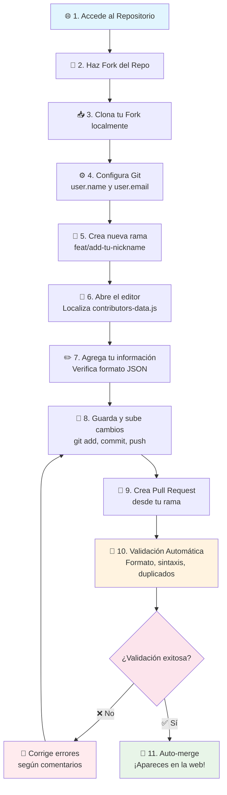

# 🚀 Repo Colaborativo - ¡Únete a la Comunidad!

Una página web colaborativa donde desarrolladores de todo el mundo pueden contribuir con su información personal y aprender sobre colaboración en proyectos open source.

## 🌐 Ver la Página Web

👉 **[Visita la página web aquí](https://dav082004.github.io/XperienceCampusWorkshop/)**

## 🎯 ¿Cómo Contribuir y Qué Practicarás?

### 🛠️ Habilidades que Desarrollarás

Al participar en este proyecto, practicarás y aprenderás:

#### **Git & GitHub Workflow**

- 🍴 **Forking**: Crear una copia del repositorio en tu cuenta
- 🌿 **Branching**: Crear y manejar ramas para organizar tu trabajo
- 📝 **Commits**: Guardar cambios con mensajes descriptivos
- ⬆️ **Push/Pull**: Sincronizar cambios entre local y remoto
- 🔄 **Pull Requests**: Proponer cambios para revisión
- 🤝 **Merge**: Integrar cambios al proyecto principal

### 🚀 Tipos de Contribución

#### **🆕 Contribución Básica (Recomendada para Principiantes)**

```javascript
// Agregar tu información personal al proyecto
{
  name: "Tu Nombre Completo",
  nickname: "tu-github-username",
  github: "https://github.com/tu-username",
  linkedin: "https://linkedin.com/in/tu-perfil", // Opcional
  description: "Breve descripción profesional (máx. 150 caracteres)",
  hobbies: ["Hobby1", "Hobby2", "Hobby3", "Hobby4"] // Máximo 4
}
```
### 🎓 Lo Que Aprenderás Paso a Paso

1. **Configuración de Entorno** → Git, GitHub, editor de código
2. **Workflow de Fork** → Cómo trabajar con copias de repositorios
3. **Gestión de Ramas** → Organizar trabajo en features separadas
4. **Commits Semánticos** → Escribir mensajes claros y descriptivos
5. **Pull Request Process** → Proponer y discutir cambios
6. **Code Review** → Recibir feedback y mejorar código
7. **Continuous Integration** → Validaciones automáticas
8. **Merge y Deploy** → Ver tu trabajo en producción

## 📊 Flujo de Contribución



### 🎯 Pasos Resumidos

| Paso  | Acción         | Comando Git                                                                                  |
| ----- | -------------- | -------------------------------------------------------------------------------------------- |
| 1-2   | Fork en GitHub | `(Botón Fork en GitHub)`                                                                     |
| 3     | Clonar fork    | `git clone https://github.com/TU_USUARIO/RepoColaborativo.git`                               |
| 4     | Configurar Git | `git config --global user.name "Tu Nombre"`                                                  |
| 5     | Crear rama     | `git checkout -b feat/add-tu-nickname`                                                       |
| 6-7   | Editar archivo | `Modificar contributors-data.js`                                                             |
| 8     | Subir cambios  | `git add . && git commit -m "feat: add tu-nickname" && git push origin feat/add-tu-nickname` |
| 9     | Crear PR       | `(GitHub UI)`                                                                                |
| 10-11 | Automático     | `Sistema valida y mergea`                                                                    |

## 🤖 Sistema Automatizado

### ✅ Validaciones Automáticas

Cuando envíes tu PR, el sistema automáticamente validará:

- ✅ Sintaxis JavaScript correcta
- ✅ Formato de datos válido
- ✅ Campos requeridos completos
- ✅ Máximo 4 hobbies
- ✅ URL de LinkedIn válida (si se proporciona)
- ✅ No duplicación de nicknames

### 🚨 Si hay errores

- Recibirás comentarios específicos sobre qué corregir
- El PR no será mergeado hasta que se corrijan los errores
- Puedes hacer commits adicionales para corregir

## 📋 Reglas y Guidelines

### ✅ Permitido

- Modificar únicamente `contributors.js`
- Agregar exactamente **1 colaborador por PR**
- Usar tu propio GitHub username como nickname
- Incluir información real y profesional

### ❌ No Permitido

- Modificar otros archivos (HTML, CSS, JS principal)
- Agregar múltiples colaboradores en un solo PR
- Usar información falsa o inapropiada
- Duplicar nicknames existentes

### 💬 ¿Necesitas ayuda?

- 🐛 [Reportar un bug](https://github.com/Dav082004/RepoColaborativo/issues/new?labels=bug)
- 💡 [Sugerir una mejora](https://github.com/Dav082004/RepoColaborativo/issues/new?labels=enhancement)

### 🌟 Contribuciones Avanzadas

¿Quieres contribuir con código? También aceptamos:

- 🐛 Corrección de bugs
- ✨ Nuevas características
- 📖 Mejoras en documentación
- 🎨 Mejoras de diseño

Para estas contribuciones, abre un issue primero para discutir los cambios.
